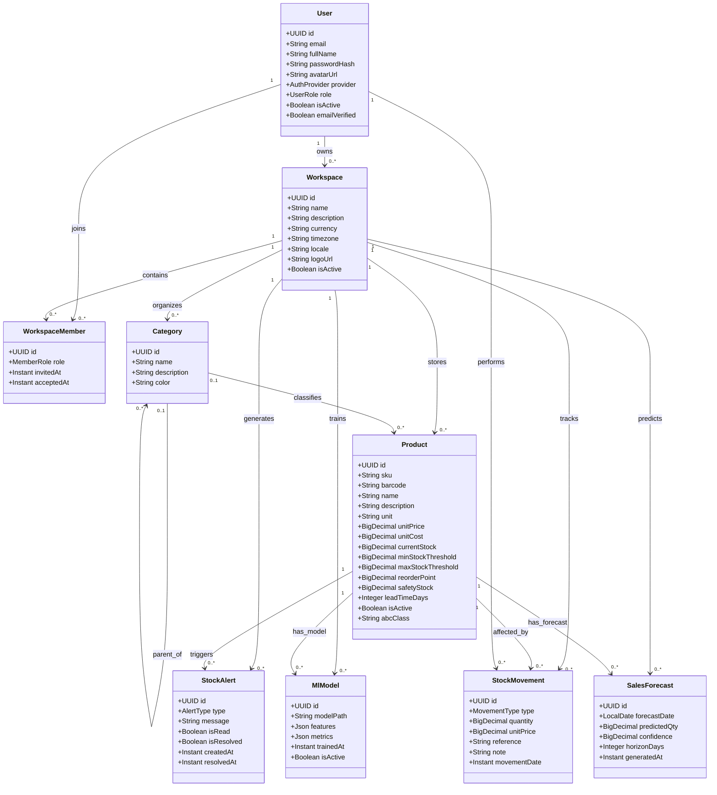

# Diagramme de classes

Le diagramme ci-dessous decrit les principales entites du domaine metier et leurs relations, telles qu'elles apparaissent dans `stock-api`.

## Version dessinee

## Points importants

- `Workspace` est l'entite centrale du systeme
- `WorkspaceMember` porte le role collaboratif (`OWNER`, `MANAGER`, `OPERATOR`, `VIEWER`)
- `Product` concentre les seuils et informations de stock
- `StockMovement` alimente a la fois la gestion operationnelle, la BI et le ML
- `MlModel` et `SalesForecast` relient le machine learning au metier
