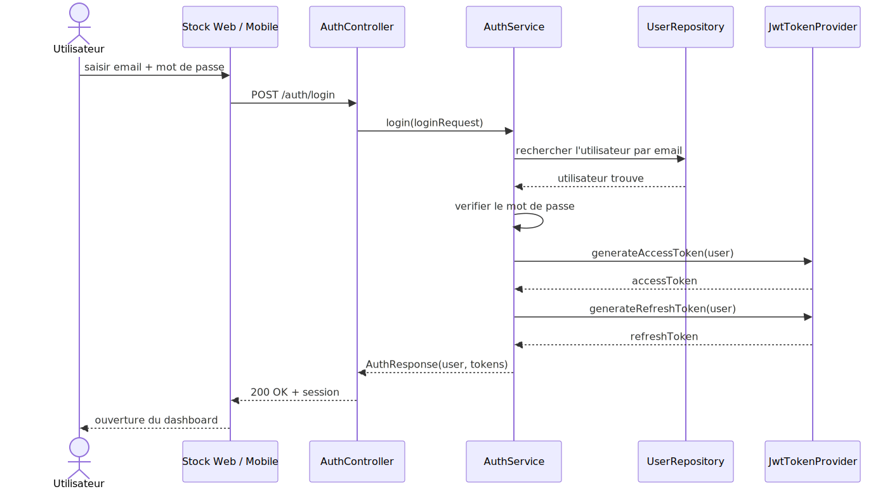
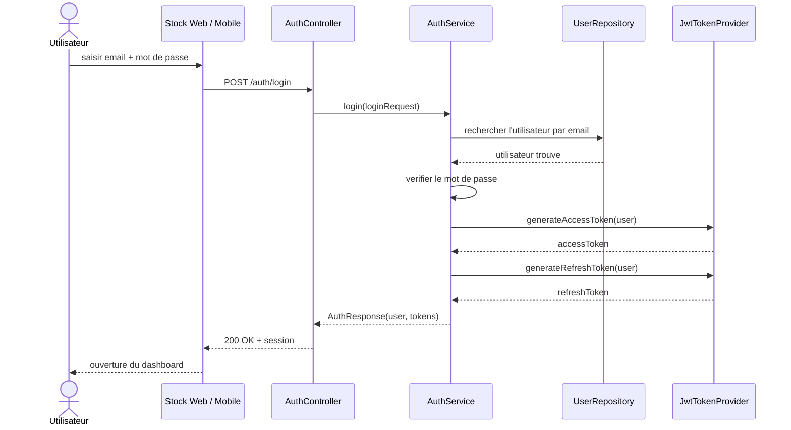
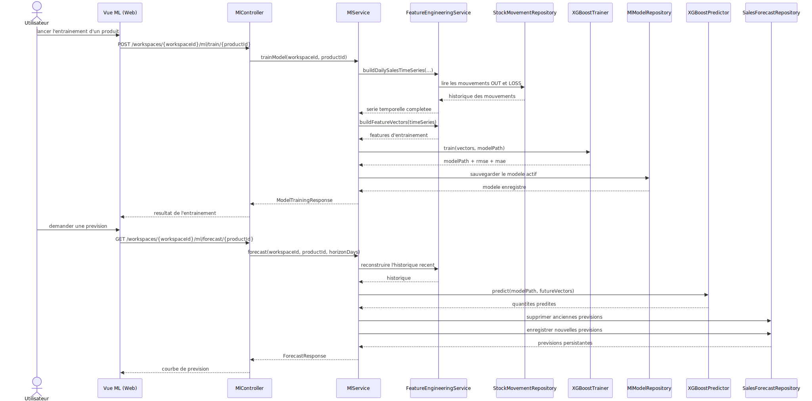
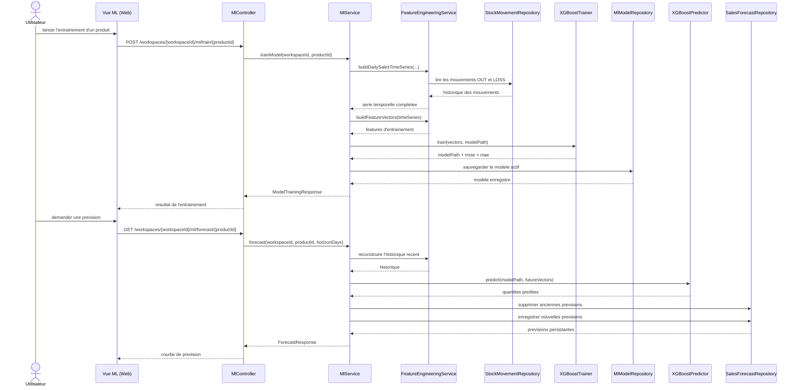

# Diagrammes de sequence

Ce fichier propose deux diagrammes de sequence Mermaid representatifs du projet :

1. authentification email
2. entrainement et prediction ML

## 1. Authentification email

## 2. Entrainement ML et generation de prevision

## Utilisation dans le rapport

- le premier diagramme peut etre utilise dans la partie **authentification / securite**
- le second diagramme peut etre utilise dans la partie **ML / XGBoost**
- si besoin, ces diagrammes peuvent etre exportes en image avant insertion dans le document Word
