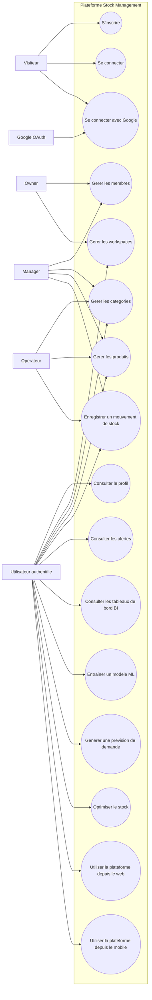

# Diagramme de cas d'utilisation

Le diagramme suivant represente les principaux acteurs et cas d'utilisation du systeme de gestion et d'optimisation des stocks.

## Version dessinee

## Lecture rapide

- le **visiteur** peut s'inscrire et se connecter
- l'**utilisateur authentifie** accede aux fonctions metier et analytiques
- le **owner** et le **manager** disposent d'un perimetre plus large sur les workspaces et les membres
- l'**operateur** participe aux operations quotidiennes de stock
- **Google OAuth** intervient dans le flux d'authentification externe
